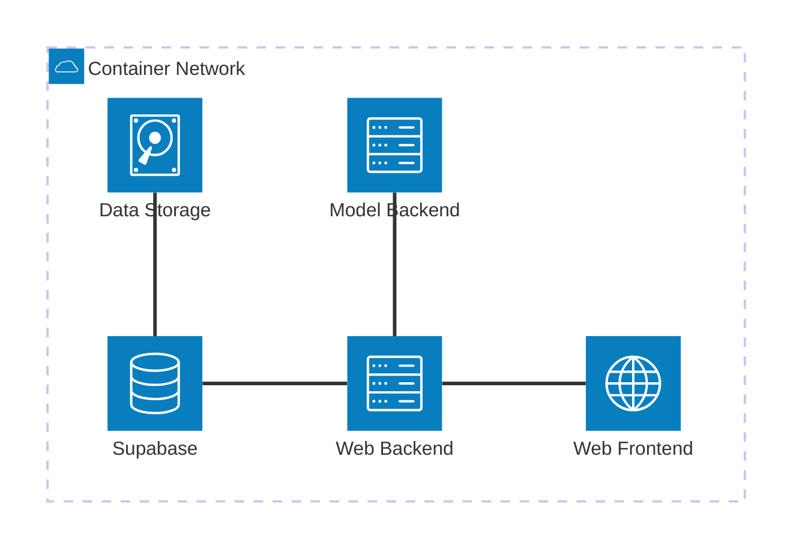

# Project Charter: Titanic Survivor Prediction Application (vFinal)

**Document Revision:** vFinal\
**Date:** Summerterm 2025

---

## Table of Contents

1. Project Title and Description
2. Project Scope and Objectives
3. Detailed Functional Requirements\
       3.1. Landing Page and User Engagement\
       3.2. User Authentication and Account Management\
       3.3. Survival Calculator\
       3.4. Advertisement and Marketing Integration\
       3.5. Admin Console and Model Management
4. Non-Functional Requirements and Environment Specifications
5. System Architecture
6. Project Timeline and Sprint Structure
7. Interface and Dependency Documentation
8. Team Structure and Responsibilities
9. Detailed Technology Stack Justification
10. Agile Methodologies and Workflow
11. Risk Management Strategy
12. Communication Plan
13. Acceptance Criteria
14. Stakeholder Identification and Expectations
15. Final Sign-Off and Revision History

---

## 1. Project Title and Description

**Title:**\
**Titanic Survivor Prediction Application**

**Description:**\
The Titanic Survivor Prediction Application is a containerized, AI-driven web application designed to predict the survival probability of Titanic passengers based on various input parameters. Simultaneously, it serves as a dynamic advertisement platform for our state-of-the-art AI courses. The application integrates four primary services—**Web Frontend**, **Web Backend**, **Model Backend**, and **Supabase** (for authentication and data storage)—all orchestrated seamlessly via Docker Compose. With real-time survival predictions, interactive user interfaces, and an administrative console for model management and training, this application showcases cutting-edge machine learning techniques and agile development practices.\
This project addresses both technical excellence and marketing strategy by providing an engaging user experience, promoting our AI education offerings, and serving as a demonstration of best practices in modern software engineering.

---

## 2. Project Scope and Objectives

### Scope

- **Frontend:**\
  Develop a Single Page Application (SPA) using React and TypeScript. The frontend will be fully responsive, optimized for desktop and mobile devices, and served behind an Nginx reverse proxy.
- **Backend:**\
  Implement business logic and ML model inference using Python with FastAPI, ensuring rapid and secure communication between services.
- **Authentication & Data Storage:**\
  Utilize a self-hosted Supabase container to manage user registration, authentication (via GoTrue), and persistent data storage (PostgreSQL).
- **Containerization:**\
  Package all services using Docker and manage orchestration with a unified Docker Compose specification.
- **CI/CD:**\
  Implement GitLab CI/CD pipelines for automated builds, unit/integration tests, and nightly end-to-end (E2E) tests.
- **Documentation:**\
  Maintain comprehensive documentation within a dedicated `docs/` folder linked to a `.git.wikis` submodule, ensuring easy access to architectural diagrams, API specifications, and deployment instructions.

### Objectives

1. **User Engagement:**
   - Deliver an interactive landing page that explains the application’s functionality.
   - Provide clear navigation linking the advertisement, survival calculator, and other sections.
2. **Accurate Predictions:**
   - Integrate robust ML algorithms (Random Forest, SVM, Logistic Regression, etc.) for reliable Titanic survival predictions.
3. **High Availability and Scalability:**
   - Ensure a stable and modular architecture through containerized services and persistent storage.
4. **Rapid Deployment and Iteration:**
   - Achieve a seamless deployment process using a single `docker-compose up --build` command without requiring additional local configurations.
5. **Agile Delivery:**
   - Follow Scrum methodologies with frequent two-week sprints to enable rapid feedback, continuous improvement, and timely identification of issues.
6. **Marketing Integration:**
   - Incorporate a compelling marketing narrative to promote AI courses, ensuring the application doubles as an effective advertisement platform.
7. **Administrative Control:**
   - Provide an admin console to manage, train, and delete ML models, thereby allowing continuous model improvement and operational flexibility.

---

## 3. Detailed Functional Requirements

### 3.1. Landing Page and User Engagement

- **Overview:**\
  The landing page serves as the entry point for all users. It offers a brief explanation of the application, highlighting its dual purpose: Titanic survival prediction and advertisement for AI courses.
- **Navigation:**
  - Prominent navigation links to all major sections: Home, Advertisement, Survival Calculator, and Admin Console.
  - Mobile-optimized design with responsive menus.
- **Marketing Content:**
  - A product story that emphasizes the innovation behind the application.
  - A strong call to action (CTA) encouraging users to explore the AI courses.
  - Integration of social media sharing buttons for organic and paid promotion.

### 3.2. User Authentication and Account Management

- **Registration and Login:**
  - Users can register using an email address and password.
  - A secure login mechanism using FastAPI and Supabase’s GoTrue for authentication.
- **Session Management:**
  - Logged-in users have a personalized experience with persistent session data.
- **User Roles:**
  - **Anonymous Users:** Limited access to survival prediction models (only Random Forest and SVM).
  - **Authenticated Users:** Full access to all available models and additional features such as prediction history.

### 3.3. Survival Calculator

- **Input Attributes:**
  - **Passenger Class:** Options include First, Second, and Third.
  - **Sex:** Male or Female.
  - **Age:** Accepts values from 0 to 100.
  - **Fare:** Accepts values from 0 to 500 USD.
  - **Traveled Alone:** Boolean choice (Yes or No).
  - **Embarked:** Options include Cherbourg, Queenstown, and Southampton.
  - **Title:** Options include Master, Miss, Mr, Mrs, and Rare.
- **User Behavior:**
  - **Real-Time Updates:** Predictions are recalculated immediately upon any change in input without requiring a page refresh.
  - **Reset Functionality:** A dedicated reset button clears all inputs instantly.
  - **Model Selection:**
    - Anonymous users are restricted to a single model selection (Random Forest or SVM).
    - Authenticated users can select any combination of trained models.
  - **Prediction Display:**
    - Display a clear outcome (“Survived” or “Did not survive”) for each selected model.
    - Logged-in users receive a persistent history of the last 10 predictions made during their session.

### 3.4. Advertisement and Marketing Integration

- **Product Story Integration:**
  - The landing page and advertisement section prominently feature the marketing narrative provided by the Marketing Director.
  - Dynamic content that highlights the advantages of AI-driven insights and showcases successful online AI courses.
- **Visual and Interactive Elements:**
  - High-quality images, infographics, and interactive elements to capture user interest.
  - Integration of testimonial snippets and success stories from previous course participants.
- **Navigation and CTAs:**
  - Clear call-to-action elements guiding users to both the survival calculator and course enrollment pages.
  - Seamless cross-linking between informational content and interactive tools.

### 3.5. Admin Console and Model Management

- **Admin Features:**
  - **Model Listing:** Admin users can view a comprehensive list of all trained models along with details such as algorithm type, used features, and custom model names.
  - **Model Deletion:** An option to remove outdated or unneeded models.
  - **Model Training:**
    - Admin users can select any subset of available features and initiate new model training processes.
    - Trained models are persisted via Docker volumes to ensure availability even after container restarts.
  - **Progress Feedback:**
    - Real-time progress indicators (e.g., “Training in progress…” messages) during long-running tasks such as model training or hyperparameter tuning.
  - **Interface Design:**
    - A user-friendly interface with clear menus, tooltips, and documentation for each function.
    - Detailed logs and monitoring capabilities to track the status and performance of model training tasks.

---

## 4. Non-Functional Requirements and Environment Specifications

### 4.1. Containerization and Deployment

- **Dockerization:**
  - All services (Web Frontend, Web Backend, Model Backend, and Supabase) are containerized using Docker.
  - The application is deployable on Ubuntu Noble Numbat 24.04 LTS with zero errors.
- **Docker Compose:**
  - A single, comprehensive `docker-compose.yml` file orchestrates all services.
  - Docker volumes ensure persistent storage for model files, the mounted Titanic dataset, and PostgreSQL data.
- **Reverse Proxy:**
  - An Nginx reverse proxy is integrated within the Web Frontend service to route external traffic to the correct internal service endpoints.
- **Zero Local Configuration:**
  - The application is fully configured to run with a single command: `docker-compose up --build`, eliminating the need for manual environment variable configuration or local file modifications.

### 4.2. CI/CD and Automated Testing

- **GitLab CI/CD Pipelines:**
  - Automated builds, tests, and deployments are triggered on every commit.
  - The pipelines include unit tests, integration tests, and nightly E2E tests using frameworks such as Pytest (for Python) and Cypress/Playwright (for frontend).
- **Version Control and Repository Management:**
  - All source code is maintained in GitLab, with clear commit messages and adherence to the official student email for grading.
  - Submodules are used for managing additional repositories (e.g., documentation in `.git.wikis`).

### 4.3. Performance and Scalability

- **Efficient Service Communication:**
  - Internal RESTful API communication is limited to the Docker network to reduce latency.
- **Data Persistence and Scalability:**
  - PostgreSQL, managed by Supabase, ensures ACID compliance and robust performance.
- **Resource Optimization:**
  - The system is designed for horizontal scalability, allowing individual services to be scaled as needed based on load and usage patterns.

---

## 5. System Architecture

The architecture of the Titanic Survivor Prediction Application is modular and service-oriented. The following diagram (created using Mermaid) illustrates the key components and their interactions within the Docker network:

### Interaction and Communication

- **Web Frontend to Web Backend:**
  - The React SPA interacts with the Web Backend through well-defined RESTful endpoints.
- **Web Backend to Model Backend:**
  - Requests for model predictions, training, and inference are securely routed to the Model Backend.
- **Authentication and Data Storage:**
  - Supabase handles user registration, session management, and persistent data storage.
- **Internal Communication:**
  - All services communicate over an isolated Docker network, ensuring security and high performance.

---

## 6. Project Timeline and Sprint Structure

To ensure rapid iteration, continuous integration, and prompt feedback, the project will be executed in **four sprints**, each spanning **2 weeks**. With a team of four dedicated full-stack developers and two dedicated Backend & Model Specialists (Emily Johnson and David Williams), our early efforts concentrate on delivering a production-ready core codebase that integrates the complete functionality skeleton: the frontend, backend (including the Model API), and the Supabase database. Core logic and configuration across all pages and endpoints are built during Sprint 1, while authentication and advanced user management are refined in Sprints 2 and 3.

### Milestones and Deliverables

| **Milestone**                          | **Deliverable**                                                                                                                                                                                                                                                                                                                                                                                                                 | **Deadline**   |
| -------------------------------------- | -------------------------------------------------------------------------------------------------------------------------------------------------------------------------------------------------------------------------------------------------------------------------------------------------------------------------------------------------------------------------------------------------------------------------------- | -------------- |
| **Project Inception (Sprint 1 Start)** | With preliminary setup already in place (repository initialization and container orchestration), Sprint 1 will deliver the integrated core codebase: <ul><li>Complete implementation of the core ML model logic in the FastAPI backend and Model API,</li><li>Full integration of Supabase with the initial database schema (authentication tables, user data, and session management),</li><li>Integration of core configuration across all services, and CI/CD configurations,</li><li>A fully bootstrapped React SPA that includes essential pages (landing page, dashboard, and placeholder pages for future routes) with basic routing and component hierarchy.</li></ul> | End of Week 2  |
| **Sprint 1 Review**                    | The core system is fully integrated and functionally operative: <ul><li>All services (frontend, backend, model, and Supabase) launch successfully with proper inter-service communication,</li><li>The FastAPI backend exposes core endpoints (e.g., `/health`, `/predict/`) and the Model API provides dummy responses,</li><li>Database connectivity via Supabase is validated and the base schema is complete,</li><li>The React SPA renders the landing page and dashboard with integrated routing and placeholder content.</li></ul>                            | End of Week 4  |
| **Sprint 2 Review**                    | Building on the core system, Sprint 2 focuses on initiating authentication and refining the APIs: <ul><li>Begin integration of secure authentication workflows and basic user management (registration, login, secure session handling) without disrupting core functionality,</li><li>Enhance backend endpoints with robust error handling, logging, and data validation,</li><li>Improve frontend interactivity by connecting UI components (such as status indicators and dynamic data displays) to the backend,</li><li>Expand unit and integration tests to cover newly added authentication and validation logic.</li></ul>                                      | End of Week 6  |
| **Sprint 3 Review**                    | Sprint 3 is dedicated to advanced feature enhancements and performance optimization: <ul><li>Refine and complete authentication and user management workflows, including user role definitions and secure session management,</li><li>Optimize ML model training routines and inference pipelines with advanced logging and error management,</li><li>Add micro-interactions and handle edge-case scenarios across services,</li><li>Initiate comprehensive end-to-end (E2E) testing using Cypress/Playwright to validate overall system integration.</li></ul>            | End of Week 8  |
| **Sprint 4 & Final Demo**              | The final sprint focuses on production hardening and overall quality assurance: <ul><li>Implement the admin console for comprehensive model management (listing, training, deletion),</li><li>Achieve complete E2E test coverage and finalize CI/CD pipelines,</li><li>Polish the user interface, marketing materials, and presentation assets based on stakeholder feedback,</li><li>Conduct final QA cycles and obtain stakeholder sign-off on all features.</li></ul>                                                     | End of Week 10 |
| **Project Submission**                 | Deliver a final comprehensive ZIP archive containing all source code, documentation, GitLab repositories, and presentation slides. All components must pass automated tests and meet production-quality standards.                                                                                                                                                                                                                | End of Week 12 |

### Detailed Sprint Breakdown

- **Sprint 1 (Weeks 1-2): Core Codebase Integration**
  - **Backend & ML API Core Development:**  
    - Develop dummy ML inference and training endpoints within the Model API using placeholder logic.
    - Define and implement core Pydantic schemas for prediction and training data.
  - **Database & Configuration:**  
    - Fully integrate the Supabase service by establishing and testing the initial database schema (authentication tables, user data, sessions).
    - Validate all environment configurations (As per requirement, the use of .env is banned) and connectivity between backend and Supabase.
  - **Frontend Core Integration:**  
    - Bootstrap the React SPA using TypeScript and Tailwind CSS.
    - Implement essential pages including the landing page and dashboard with basic routing and functional UI components.
  - **Core Testing & CI/CD:**  
    - Ensure that all core components are covered by initial unit tests.
    - Validate that containers launch and communicate via Docker Compose.
  - **Task Management:**  
    - All tasks are tracked in the project’s issue tracker with clear assignment and deadlines (refer to the detailed Sprint 1 task document).

- **Sprint 2 (Weeks 3-4): Authentication & API Refinement**
  - **Authentication & User Management Initiation:**  
    - Integrate basic user registration and login functionalities.
    - Begin implementing secure session management and assign preliminary user roles.
  - **Backend Refinement:**  
    - Enhance error handling, logging, and data validation in backend endpoints.
    - Expand unit tests to verify improvements and new authentication flows.
  - **Frontend Enhancements:**  
    - Enhance the landing page and dashboard by integrating dynamic content from backend endpoints.
    - Ensure smooth connection between frontend components and newly implemented authentication mechanisms.

- **Sprint 3 (Weeks 5-6): Feature Enhancement & Performance Optimization**
  - **Advanced Authentication & API Refinement:**  
    - Complete and refine full authentication and user management workflows.
    - Improve API stability by optimizing ML model training routines and inference pipelines.
  - **Performance Optimization:**  
    - Integrate advanced logging and error management practices.
    - Address edge-case handling and fine-tune backend performance based on test feedback.
  - **End-to-End Testing:**  
    - Initiate comprehensive E2E tests using Cypress/Playwright to ensure system-wide integration.

- **Sprint 4 & Final Demo (Weeks 7-8): Production Hardening & Final QA**
  - **Admin Console Development:**  
    - Fully implement an admin console for model management, including listing, training, and deletion functionalities.
  - **Final UI/UX Polishing:**  
    - Incorporate final stakeholder feedback to refine the user interface across the application.
  - **Quality Assurance:**  
    - Achieve full E2E test coverage, finalize CI/CD configurations, and conduct thorough QA sessions.
    - Secure final stakeholder approval before the project submission.

---

## 7. Interface and Dependency Documentation

- **API Specifications:**
  - All RESTful APIs between the Web Backend and Model Backend are documented using OpenAPI/Swagger.
  - Semantic versioning (v1.0.0, v1.1.0, etc.) is used to track API changes.
- **Submodules and Documentation Repository:**
  - A dedicated `docs/` folder, linked as a `.git.wikis` submodule, contains all architectural diagrams, endpoint definitions, and deployment instructions.
- **Naming Conventions:**
  - Consistent naming patterns are enforced: kebab-case for URLs, snake\_case for database fields, and semantic identifiers for model versions.
- **Dependency Management:**
  - All external libraries, Docker images, and API dependencies are documented in a central dependency management file.
  - Regular updates and audits ensure compatibility and security.

---

## 8. Team Structure and Responsibilities

### Collaborative and Overlapping Roles

The team is structured to encourage collaboration across the entire stack, ensuring that every member has a comprehensive understanding of the system.

- **Alex (Lead Developer & Project Manager):**
  - Overall project coordination, task allocation, and schedule management.
  - Oversees architecture design, CI/CD pipeline configuration, and documentation updates.
- **Fullstack Developers (John Doe, Jane Smith, Michael Brown, Sarah Davis):**
  - Develop and maintain the Web Frontend using React/TypeScript.
  - Implement RESTful endpoints and business logic in the Web Backend (FastAPI).
  - Contribute to unit, integration, and E2E testing.
- **Backend & Model Specialists (Emily Johnson, David Williams):**
  - Focus on the Model Backend and Supabase/Postgres integration.
  - Develop, train, and manage ML models ensuring high performance and scalability.
  - Support API security, container orchestration, and CI/CD processes.
- **Cross-Functional Responsibilities:**
  - All team members participate in code reviews, sprint planning, and retrospective meetings to foster a collaborative environment.
  - Regular knowledge sharing sessions ensure continuous improvement and comprehensive system understanding.

---

## 9. Detailed Technology Stack Justification

### Frontend

- **React + TypeScript:**
  - Provides a robust and maintainable architecture for developing a Single Page Application (SPA).
  - Ensures type safety, easier debugging, and enhanced code quality.
- **Tailwind CSS:**
  - Accelerates UI development with utility-first styling, enabling rapid prototyping and consistent design.
- **Cypress/Playwright:**
  - Used for end-to-end (E2E) testing, ensuring the application meets functional requirements and delivers a smooth user experience.

### Backend

- **Python + FastAPI:**
  - Facilitates rapid development with strong performance and built-in data validation.
- **Pytest:**
  - Ensures comprehensive unit and integration testing for backend logic.
- **RESTful API Framework:**
  - Provides secure and efficient communication between the frontend, backend, and model inference services.

### Model Backend

- **Scikit-Learn:**
  - Implements machine learning models such as Random Forest, Support Vector Machines, Logistic Regression, and Decision Trees based on proven techniques from the proof-of-concept notebook.
- **Pickle for Model Persistence:**
  - Allows trained models to be saved and reloaded from disk, ensuring continuity across container restarts.
- **FastAPI Microservice:**
  - Serves as a dedicated API for model training and inference, isolated within the Docker network.

### Authentication and Data Storage (Supabase)

- **Supabase (Postgres + GoTrue):**
  - Provides robust user authentication, session management, and data persistence with high availability.
- **Supavisor:**
  - Enables connection pooling for improved database performance and scalability.

### Containerization and CI/CD

- **Docker & Docker Compose:**
  - Offer a reproducible, scalable, and modular deployment environment.
- **GitLab CI/CD:**
  - Automates builds, testing (unit, integration, and E2E), and deployments to the GitLab Container Registry.
- **Nginx Reverse Proxy:**
  - Securely routes external traffic to the appropriate internal services and serves static files efficiently.

---

## 10. Agile Methodologies and Workflow

### Scrum Framework

- **Sprint Planning:**
  - Define sprint backlog items based on the prioritized product backlog.
  - Ensure tasks are well-scoped and assigned to the appropriate team members.
- **Standup Meetings:**
  - Conduct brief meetings 2 times a week, to discuss progress, identify blockers, and coordinate tasks.
- **Sprint Reviews and Demonstrations:**
  - Present completed features to stakeholders for feedback at the end of each sprint.
- **Sprint Retrospectives:**
  - Evaluate the sprint process, discussing what worked well and what can be improved for future sprints.
- **Iterative Development:**
  - Adopt two-week sprints to allow rapid iterations, timely feedback, and flexibility to adjust scope based on testing outcomes and stakeholder inputs.

---

## 11. Risk Management Strategy

### Identified Risks and Mitigation Measures

1. **Scope Creep:**
   - **Mitigation:**
     - Enforce strict backlog grooming and require sponsor approval for any changes to the project scope.
     - Maintain a detailed product backlog with clearly defined priorities.
2. **Technical Bottlenecks:**
   - **Mitigation:**
     - Utilize pair programming and regular code reviews to ensure collective ownership of complex modules.
     - Conduct frequent integration tests to detect issues early.
3. **Deployment Failures:**
   - **Mitigation:**
     - Implement automated CI/CD pipelines with rollback strategies in case of failed deployments.
     - Conduct extensive unit, integration, and end-to-end tests to ensure stability.
4. **Resource Constraints:**
   - **Mitigation:**
     - Maintain clear task assignments and regularly update the team on progress.
     - Use agile standups and retrospectives to promptly identify and address resource limitations.

---

## 12. Communication Plan

### Internal Communication

- **2 Standup Meetings A Week:**
  - Quick updates on progress and identification of blockers, held via video conferencing.
- **Bi-Weekly Team Meetings:**
  - Detailed discussions on sprint progress, integration issues, and planning for the upcoming sprint.
- **Collaboration Platforms:**
  - Use WhatsApp group (e.g., `team/random_iceberg`) for rapid, informal communication.
- **GitLab Issues/Boards:**
  - Centralized task management, progress tracking, and backlog refinement through GitLab.

### External Communication

- **Stakeholder Updates:**
  - Regular status updates and sprint review meetings with the Course Instructor, Marketing Director, and end-user representatives.
- **Documentation Sharing:**
  - Maintain an up-to-date repository of documentation accessible to all stakeholders via the `docs/` folder and GitLab wikis.
- **Presentation Meetings:**
  - Organize final presentation sessions where team members detail their individual contributions and the overall project achievements.

---

## 13. Acceptance Criteria

The project is considered complete and production-ready when the following criteria are met:

- **Zero-Configuration Deployment:**
  - The application launches successfully using `docker-compose up --build` on Ubuntu Noble Numbat 24.04 LTS with no errors.
- **User Registration and Authentication:**
  - Users can register, log in, and recover accounts using the prescribed authentication mechanisms.
- **Functional Survival Calculator:**
  - The survival calculator updates predictions in real-time based on user inputs.
  - Anonymous users are limited to a single model selection, while authenticated users can select multiple models.
  - A persistent history of the last 10 prediction results is maintained for logged-in users.
- **Admin Console Functionality:**
  - Admin users can view, train, and delete ML models through an intuitive interface.
- **Advertisement and Marketing:**
  - The landing page and advertisement sections effectively promote the AI courses with engaging narratives and CTAs.
- **Automated Testing:**
  - All unit, integration, and nightly end-to-end tests pass consistently as part of the GitLab CI/CD pipeline.
- **Comprehensive Documentation:**
  - All architectural diagrams, API specifications, dependency lists, and deployment instructions are complete and up to date.
- **User Experience and Performance:**
  - The application is responsive, scalable, and delivers a seamless user experience across supported browsers (Chrome ≥ 119, Firefox ≥ 122, Safari ≥ 16.1).

---

## 14. Stakeholder Identification and Expectations

### Primary Stakeholders

- **Course Instructor (Prof. Dr. Christoph Schober):**
  - Expects a robust technical solution demonstrating agile methodologies, accurate Titanic survival predictions, and adherence to all project requirements.
- **Marketing Director (TL;DR):**
  - Seeks a visually compelling, user-friendly application that effectively promotes AI courses and drives engagement via organic and paid social media campaigns.
- **End-Users:**
  - Demand a reliable, interactive platform that not only provides accurate survival predictions but also offers a seamless and engaging user experience.
- **Development Team:**
  - Requires clear project guidelines, frequent feedback, and a collaborative environment that encourages continuous learning and high-quality deliverables.

---

## 15. Final Sign-Off and Revision History

### Sign-Off

By signing below, the team confirms that the project charter is complete, meets all functional and non-functional requirements, and is ready for final implementation.

- **Alex** – Lead Developer & Project Manager
- **John Doe** – Fullstack Developer
- **Jane Smith** – Fullstack Developer
- **Michael Brown** – Fullstack Developer
- **Sarah Davis** – Fullstack Developer
- **Emily Johnson** – Backend & Model Specialist
- **David Williams** – Backend & Model Specialist

---

*This document represents the final production-ready project charter for the Titanic Survivor Prediction Application. Every section has been developed in accordance with the project requirements, with a clear focus on robust architecture, agile development practices, and seamless user experience. The four sprint cycles, each lasting two weeks, have been chosen to enable rapid iteration and prompt feedback, ensuring that any issues are identified early and resolved effectively. This agile approach allows for a high degree of flexibility and continuous improvement throughout the development process.*

---

*Prepared by the Titanic Survivor Prediction Application Team. All team members have reviewed and approved the content, ensuring that the final deliverable meets or exceeds all project expectations and quality standards.*