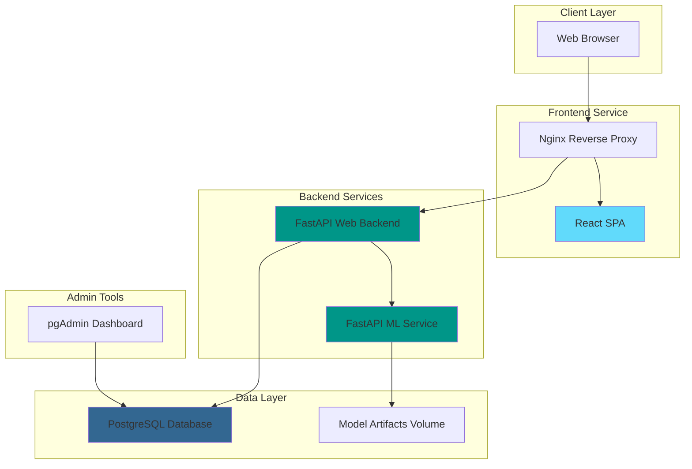

<h1 align="center">

  
</h1>

<p align="center">
  <strong>A production-ready web application that predicts Titanic passenger survival using machine learning models</strong>
</p>

<p align="center">
  <a href="https://github.com/random-iceberg/docker-compose">
    
  </a>
  <a href="https://www.python.org/downloads/release/python-3130/">
    
  </a>
  <a href="https://reactjs.org/">
    
  </a>
  <a href="https://www.docker.com/">
    
  </a>
  <a href="https://fastapi.tiangolo.com/">
    
  </a>
</p>

---

## 🚀 Quick Start (Zero Configuration)

> [!TIP]
> **One-Command Deployment** - The entire application stack can be deployed with a single command!

### Production Deployment

```bash
# Clone with all submodules
git clone --recurse-submodules https://github.com/random-iceberg/docker-compose.git
cd docker-compose

# Start all services (production build)
docker compose up --build -d

# Access the application
open http://localhost:8080
```

### Using Pre-built Images

```bash
# Use latest images from GitHub Container Registry
docker compose -f compose/compose.latest.yaml up --build --pull always -d

# Access the application
open http://localhost:8080
```

> [!IMPORTANT]
> **Default User Accounts**
> - **Admin**: `email="admin@test"`, `password="apass"`
> - **User**: `email="user@test"`, `password="upass"`

---

## 🏗️ Architecture Overview



| Service | Port | Technology | Purpose |
|---------|------|------------|---------|
| **Frontend** | 8080 | React + Nginx | User interface and reverse proxy |
| **Backend** | 8000 | FastAPI | Authentication, business logic |
| **Model** | 8001 | FastAPI | ML inference and training |
| **Database** | 5432 | PostgreSQL | Data persistence |
| **pgAdmin** | 5050 | pgAdmin4 | Database administration |

---

## ✨ Features

### 🎯 Core Functionality
- **Survival Prediction**: Real-time predictions based on passenger attributes
- **Multiple ML Models**: Random Forest, SVM, Decision Tree, KNN, Logistic Regression
- **Model Management**: Train, evaluate, and delete ML models
- **User Authentication**: JWT-based secure authentication
- **Admin Console**: Model training and management interface
- **Prediction History**: Track user predictions (last 10 per user)

### 🛡️ Security & Performance
- **Role-Based Access Control**: Anonymous, User, and Admin roles
- **Input Validation**: Comprehensive data validation and sanitization
- **Health Checks**: Service monitoring and health endpoints
- **Error Handling**: Structured error responses with correlation IDs
- **Performance**: <150ms prediction latency (local deployment)

### 📱 User Experience
- **Mobile-First Design**: Responsive across all devices
- **Real-Time Updates**: Live prediction updates on input changes
- **Accessible UI**: WCAG-compliant interface design
- **Progressive Web App**: Modern web standards implementation

---

## 🛠️ Development Workflow

### Development Environment

```bash
# Start development environment with hot reload
docker compose -f compose/compose.dev.yaml up -d --build

# Access services:
# - Frontend: http://localhost:8080 (with hot reload)
# - Backend API: http://localhost:8000/docs
# - Model API: http://localhost:8001/docs
# - pgAdmin: http://localhost:5050
```

> [!NOTE]
> **Development Features**
> - Hot module replacement for React
> - Auto-reload for FastAPI services
> - Live code synchronization
> - Development debugging tools

### Service URLs

| Service | Development | Production | Documentation |
|---------|-------------|------------|---------------|
| **Frontend** | http://localhost:8080 | http://localhost:8080 | - |
| **Backend API** | http://localhost:8000/docs | http://localhost:8080/api/docs | Swagger UI |
| **Model API** | http://localhost:8001/docs | Internal only | Swagger UI |
| **pgAdmin** | http://localhost:5050 | http://localhost:5050 | Web Interface |

---

## 📁 Project Structure

```
docker-compose/
├── 📄 docker-compose.yaml          # Default (production) configuration
├── 📁 compose/                     # Compose configurations
│   ├── compose.dev.yaml            # Development with hot reload
│   ├── compose.prod-local.yaml     # Production from local build
│   └── compose.latest.yaml         # Production from registry
├── 📁 app/                         # Application services (submodules)
│   ├── 📁 frontend/                # React frontend (submodule)
│   └── 📁 backend/                 # FastAPI backend (submodule)
├── 📁 model/                       # ML service (submodule)
├── 📁 docs/                        # Documentation (submodule)
└── 📁 postgres/                    # Database initialization
```

### Git Submodules

| Repository | Path | Description |
|------------|------|-------------|
| [web-frontend](https://github.com/random-iceberg/web-frontend) | `app/frontend/` | React TypeScript frontend |
| [web-backend](https://github.com/random-iceberg/web-backend) | `app/backend/` | FastAPI web backend |
| [model-backend](https://github.com/random-iceberg/model-backend) | `model/` | ML inference service |
| [docker-compose.wiki](https://github.com/random-iceberg/docker-compose.wiki) | `docs/` | Project documentation |

---

## 🧪 Testing & Quality Assurance

### Running Tests

```bash
# Backend tests
cd app/backend
uv run pytest --cov=. --cov-report=html

# Frontend tests
cd app/frontend
npm test

# Model service tests
cd model
uv run pytest

# Integration tests (Playwright)
npm run test:e2e
```

### Quality Metrics
- **Test Coverage**: >80% across all services
- **Code Quality**: Ruff (Python), ESLint + Prettier (TypeScript)
- **Type Safety**: Full TypeScript and Python type annotations
- **API Documentation**: Auto-generated Swagger/OpenAPI specs

---

## 🐳 Docker Configurations

### Available Configurations

| Configuration | Use Case | Command |
|---------------|----------|---------|
| **Production (Local Build)** | Testing production build | `docker compose up` |
| **Development** | Local development | `docker compose -f compose/compose.dev.yaml up` |
| **Latest (Registry)** | Using pre-built images | `docker compose -f compose/compose.latest.yaml up` |

### Environment Variables

> [!WARNING]
> **Security Notice**: Change default passwords in production deployments!

| Variable | Default | Description |
|----------|---------|-------------|
| `POSTGRES_PASSWORD` | `_postgres` | PostgreSQL root password |
| `POSTGRES_PASSWORD_BACKEND` | `_backend` | Backend database password |
| `JWT_SECRET_KEY` | `_ultrasecurejwtsecretkey` | JWT signing secret |
| `PGADMIN_DEFAULT_EMAIL` | `team@random.iceberg` | pgAdmin login email |
| `PGADMIN_DEFAULT_PASSWORD` | `Cheezus123` | pgAdmin login password |

---

## 📊 Machine Learning Models

### Available Algorithms

| Algorithm | ID | Use Case | Default Features |
|-----------|----|---------| -----------------|
| **Random Forest** | `rf` | High accuracy, interpretable | All features |
| **Support Vector Machine** | `svm` | Non-linear patterns | All features |
| **Decision Tree** | `dt` | Interpretable rules | All features |
| **K-Nearest Neighbors** | `knn` | Simple, effective | All features |
| **Logistic Regression** | `lr` | Baseline model | All features |

### Features Used

Based on the original Titanic dataset with feature engineering:
- **Passenger Class** (1st, 2nd, 3rd)
- **Sex** (Male, Female)
- **Age** (0-100 years)
- **Fare** (0-500 USD)
- **Embarked** (Cherbourg, Queenstown, Southampton)
- **Title** (Mr, Mrs, Miss, Master, Rare)
- **Traveled Alone** (Boolean)
- **Age × Class** (Interaction feature)

---

## 🔧 Troubleshooting

### Common Issues

> [!TIP]
> **Port Conflicts**: If ports 8080, 8000, or 5432 are in use, modify the port mappings in the compose files.

**Services not starting:**
```bash
# Check service logs
docker compose logs -f [service-name]

# Restart specific service
docker compose restart [service-name]

# Full cleanup and restart
docker compose down -v
docker compose up --build -d
```

**Database connection issues:**
```bash
# Check database health
docker compose exec postgres pg_isready -U backend -d backend

# Reset database
docker compose down -v
docker compose up postgres -d
```

**Model training failures:**
```bash
# Check model service logs
docker compose logs -f model

# Verify model files
docker compose exec model ls -la /data/models/
```

### Performance Optimization

> [!NOTE]
> **Resource Requirements**
> - **Minimum**: 4GB RAM, 2 CPU cores
> - **Recommended**: 8GB RAM, 4 CPU cores
> - **Storage**: ~2GB for images and data

---

## 🔗 Service Documentation

| Service | Documentation | API Reference |
|---------|---------------|---------------|
| **Frontend** | [README](./app/frontend/README.md) | - |
| **Backend** | [README](./app/backend/README.md) | [Swagger UI](http://localhost:8000/docs) |
| **Model Service** | [README](./model/README.md) | [Swagger UI](http://localhost:8001/docs) |
| **Project Docs** | [Documentation](./docs/) | - |

---

## 🎓 Academic Project

> [!NOTE]
> **University Project**: This application was developed as part of the **Software Engineering** course at **Deggendorf Institute of Technology (DIT)** under **Prof. Dr. Christoph Schober**.

**Project Requirements Fulfilled:**
- ✅ Containerized microservices architecture
- ✅ RESTful API design with FastAPI
- ✅ React single-page application
- ✅ Machine learning model integration
- ✅ User authentication and authorization
- ✅ Responsive mobile-first design
- ✅ Automated testing and CI/CD
- ✅ Production-ready deployment

---

## 📄 License

This project is licensed under the MIT License - see the [LICENSE](LICENSE) file for details.

---

<p align="center">
  <strong>Built with ❤️ by Team Random Iceberg</strong><br>
  <em>Demonstrating modern full-stack development with AI/ML integration</em>
</p>

<p align="center">
  <a href="https://github.com/random-iceberg">GitHub Organization</a> •
  <a href="./docs/Project-Requirements.md">Project Requirements</a> •
  <a href="./docs/Sprint-1.md">Development Sprints</a>
</p>
